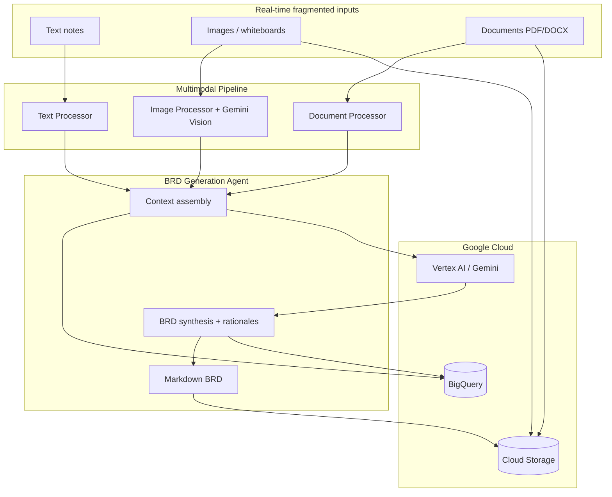

# BRD Generation Agent

A scalable, **multi-modal AI system** built on **Google Gemini** (Vertex AI) and integrated **Google Cloud** services — **Cloud Storage**, **BigQuery**, and **Vertex AI** — that processes real-time, fragmented data (text, images, documents) and delivers accurate, **context-aware**, and **explainable** Business Requirements Documents (BRDs).

## Architecture



## Features

| Capability | Implementation |
|------------|----------------|
| Multi-modal ingestion | Text, images (vision), PDF/DOCX documents |
| Real-time API | FastAPI with JSON and multipart endpoints |
| Context persistence | BigQuery `context_fragments` table |
| Explainability | Per-section confidence, reasoning, source fragment IDs |
| Decision audit trail | BigQuery `decision_log` table |
| Artifact storage | Generated BRDs uploaded to GCS |
| Historical context | Prior fragments queried from BigQuery for enrichment |
| Offline / mock mode | Local dev without GCP credentials |
| Streamlit UI | Browser-based BRD generation |
| Terraform IaC | GCS, BigQuery, IAM, optional Cloud Run |

## Project Structure

```
BRD/
├── config/settings.py       # Environment-based configuration
├── src/
│   ├── agents/brd_agent.py  # Core BRD generation orchestrator
│   ├── processors/          # Text, image, document processors
│   ├── cloud/               # Vertex AI, GCS, BigQuery clients
│   ├── api/routes.py        # REST API
│   ├── ui/streamlit_app.py  # Streamlit UI
│   ├── cloud/mock_clients.py # Offline mock GCP clients
│   └── main.py              # CLI + FastAPI entry
├── terraform/               # GCP infrastructure (Terraform)
├── tests/                   # Pytest unit & integration tests
├── templates/brd_template.md
├── scripts/setup_gcp.py     # GCP resource provisioning
└── Dockerfile               # Cloud Run deployment
```

## Prerequisites

- Python 3.11+
- Google Cloud project with billing enabled
- [gcloud CLI](https://cloud.google.com/sdk/docs/install) authenticated
- IAM roles: `Vertex AI User`, `Storage Object Admin`, `BigQuery Data Editor`

## Quick Start

### 1. Install dependencies

```bash
cd d:\BRD
python -m venv .venv
.venv\Scripts\activate
pip install -r requirements.txt
```

### 2. Configure environment

```bash
copy .env.example .env
```

Edit `.env` and set `GCP_PROJECT_ID`, `GCS_BUCKET_NAME`, and other values.

For **local development without GCP**, keep `OFFLINE_MODE=true` (default in `.env.example`).

### 3. Run tests (offline)

```bash
pytest
```

### 4. Launch Streamlit UI

```bash
python -m src.main ui
```

Open http://localhost:8501 — toggle **Offline / Mock mode** in the sidebar (enabled by default).

### 5. Provision GCP resources

```bash
python scripts/setup_gcp.py --project YOUR_PROJECT_ID --bucket brd-agent-artifacts
```

Or via CLI:

```bash
python -m src.main setup
```

### 6. Generate a BRD (CLI)

```bash
python -m src.main generate ^
  --project "Customer Portal Redesign" ^
  --context "Modernize B2B portal for enterprise clients" ^
  --text "Users need SSO and role-based dashboards" ^
  --document ".\inputs\legacy_spec.pdf" ^
  --image ".\inputs\wireframe.png" ^
  --output ".\outputs\brd.md"
```

Set `OFFLINE_MODE=true` in `.env` to run without GCP credentials.

### 7. Start the API server

```bash
python -m src.main serve
```

**Health check:** `GET http://localhost:8080/api/v1/health`

**Text-only BRD:**

```bash
curl -X POST http://localhost:8080/api/v1/brd/generate ^
  -H "Content-Type: application/json" ^
  -d "{\"project_name\": \"API Gateway\", \"business_context\": \"Unified API layer\", \"text_fragments\": [{\"content\": \"Must support OAuth2 and rate limiting\"}]}"
```

**Multi-modal BRD (multipart):**

```bash
curl -X POST http://localhost:8080/api/v1/brd/generate-multimodal ^
  -F "project_name=Inventory System" ^
  -F "business_context=Real-time stock tracking" ^
  -F "text_notes=Warehouse staff use handheld scanners" ^
  -F "documents=@spec.pdf" ^
  -F "images=@process_flow.png"
```

## Explainability Model

Every BRD section includes a `DecisionRationale`:

- **reasoning** — Why the agent wrote this content
- **confidence** — 0.0–1.0 score grounded in source quality
- **source_fragment_ids** — Which inputs supported the decision
- **supporting_evidence** — Quotes or paraphrases from fragments

Rationales are persisted to BigQuery for audit, compliance, and analytics.

## Online Mode

Three ways to run online:

| Mode | Requirements |
|------|----------------|
| **Google AI Studio** | Set `GEMINI_API_KEY` in `.env` ([get key](https://aistudio.google.com/apikey)) |
| **Vertex AI (full)** | `GCP_PROJECT_ID` + `gcloud auth application-default login` |
| **Offline mock** | `OFFLINE_MODE=true` (default for local dev) |

With `GEMINI_API_KEY` only, BRD generation uses the real Gemini API; GCS/BigQuery use local mocks.

## Offline / Mock Mode

Set `OFFLINE_MODE=true` in `.env` to use in-memory substitutes:

| Service | Mock behavior |
|---------|---------------|
| Vertex AI / Gemini | Deterministic BRD JSON from input fragments |
| Cloud Storage | Local files under `data/mock_gcs/` |
| BigQuery | In-memory context and decision stores |

## Terraform (Infrastructure as Code)

```bash
cd terraform
copy terraform.tfvars.example terraform.tfvars
# Edit terraform.tfvars with your project_id

terraform init
terraform plan
terraform apply
```

Resources created: APIs enabled, GCS bucket, BigQuery dataset/tables, service account + IAM. Set `deploy_cloud_run = true` after pushing your container image.

## Deploy to Cloud Run

```bash
gcloud builds submit --tag gcr.io/YOUR_PROJECT_ID/brd-agent
gcloud run deploy brd-agent ^
  --image gcr.io/YOUR_PROJECT_ID/brd-agent ^
  --region us-central1 ^
  --set-env-vars GCP_PROJECT_ID=YOUR_PROJECT_ID,GCS_BUCKET_NAME=brd-agent-artifacts
```

## API Reference

| Method | Endpoint | Description |
|--------|----------|-------------|
| GET | `/api/v1/health` | Service health |
| POST | `/api/v1/brd/generate` | JSON text fragments → BRD |
| POST | `/api/v1/brd/generate-multimodal` | Form + file uploads → BRD |
| GET | `/api/v1/brd/context` | Query historical fragments |

## License

MIT
